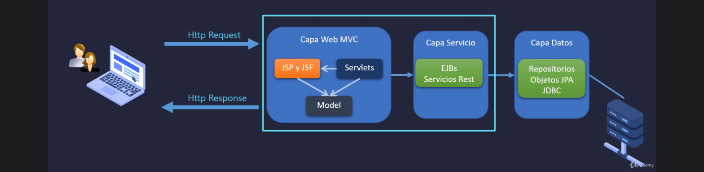
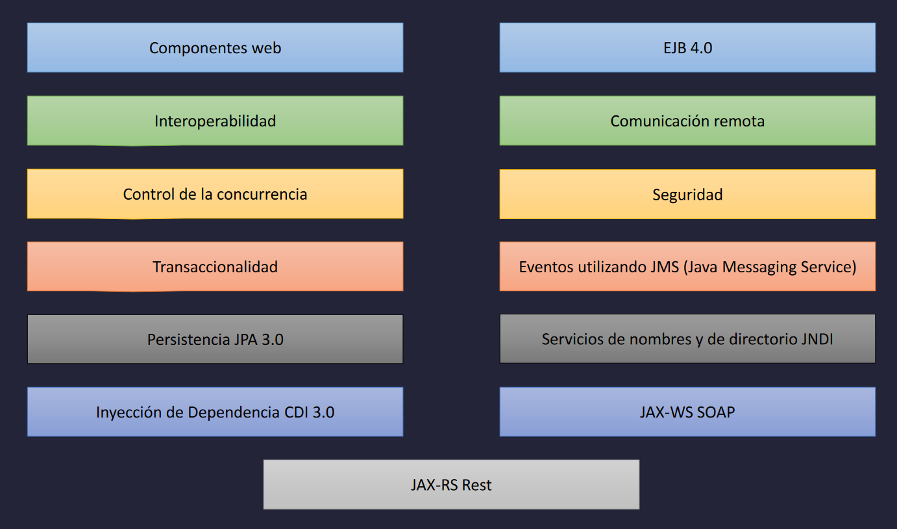

## Que es HTTP

El Protocolo de transferencia de hipertexto permite la comunicación entre un cliente, normalmente un navegador web y un servidor web para compartir datos en diferentes formatos, como html, json, imágenes, videos, pdf, Excel etc) en la World Wide Web

* Get cuando es mediante URL. (Normalmente los parametros se ven en la URL como attributo=valor)
* POST cuando es mediante un formulario.
* PUT Modificar datos
* Cabeceras: IP, nombre del cliente, el tipo de objeto, si enviamos parametros por URL, formulario, etc.
* Códigos de estatus:
    * 200: OK
    * 400: Error en datos
    * 500: TimeOut

## Qué es Java EE
Un conjunto de especificaciones, parte de la Plataforma Java, para desarrollar y ejecutar aplicaciones web utilizando arquitecturas de N capas que se despliegan sobre un servidor de aplicaciones.

### Capa de servicio
* EJBs: Enterprise Java Beans.
* Servicios REST.

### Capa de datos
* Repositorios de objetos JPA JDBC

### Caracteristicas

* WAR (Web Application ARchive)
* EAR (Java Enterprise ARchive)