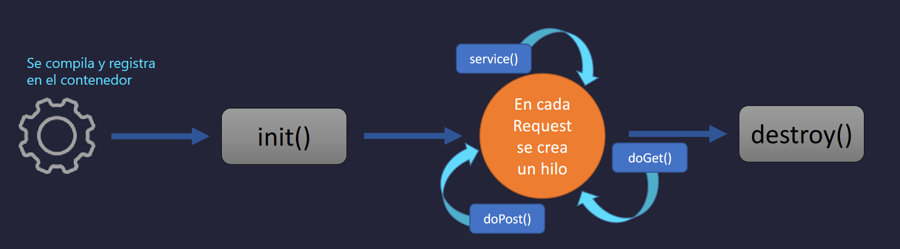

# Introducción a la API Serverlet

Es una clase de java que se utiliza para crear una página web dinámica, la cual tolera peticiones HTTP, es decir, recive request, los maneja y de acuerdo al procesamiento que se realiza devuelve una respuesta. Otra caracteristica es que son manejados, es decir, se crean por el contenedor web (serverlet) los cuales tienen un ciclo de vida manejado por el contenedor. 

Otro punto importante es que son mapeados a una rula URL.

## Cómo funciona el Serverlet

Tenemos los siguientes elementos:

* Cliente (Ej. Un navegador con contenido estático)
* Petición mediante una enlace URL enviando info al servidor, el que maneja esto es el Serverlet

El usuario puede enviar parametros, el serverlet los recibe y procesa.

## Patron de diseño
Con los Serverlet podemos implementar el patron MVC.
Vista --> JSP

Un JSP puede tener código HTML embebido dentro del mismo código Java dentro de la misma clase mediante el objeto **print Writer**. Haciendo que el Serverlet tenga papel de vista y controlador al mismo tiempo, aunque no es recomendable.

Lo ideal es tener la siguiente estructura:

**Capa web MVC**
JSP --> Model
Serverlet --> JSP
Serverlet --> Model

## Peticiones 

¿Qué es un request (petición web)?

* Información que es enviada desde un cliente hacia el servidor
* Datos ingresados e enviados por el usuario
* Método Http (Get o Post)
* Cabeceras HTTP (headers)

¿Que es un response (respuesta web)?
* Información que es enviada al cliente desde el servidor
* Texto(html, plain, json, xml) o datos binarios (imágenes, pdf, videos)
* HTTP headers, cookies, etc

## Métodos soportados

Los métodos HTTP soportados por el API Servlet son 7:
• doDelete
• doGet
• doHead
• doOptions
• doPost
• doPut
• doTrace

## Estructura

Para poder utilizar los Serverlets tendremos que heredar de la clase **HttpServlet**
* Servlet interfaz: Contiene métodos init, service, destroy.

## Ciclo de vida de un servlet

Algo importante es que cuando se ejecuta un request se ejecuta un único hilo, a su vez se ejecuta un método Service por cada objeto y response.

Lo ideal es que un servlet no maneje estado porque es compartido por diferentes usuarios. **OJO**: no se comparte el Service().

Si quisieramos tener un estado podriamos tener otro objeto como **sesion**
